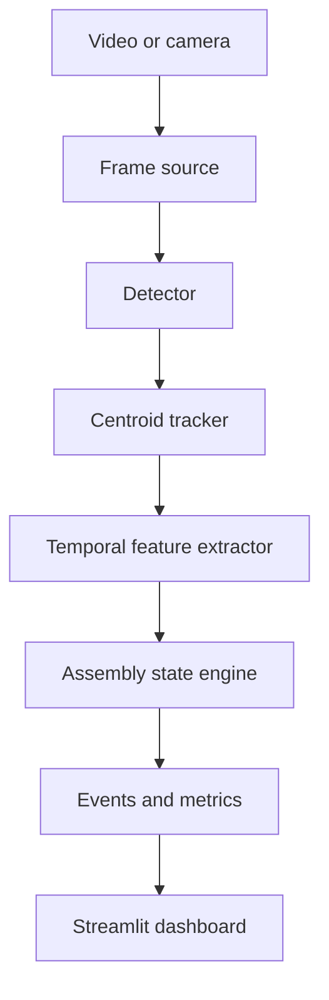

# AssemblyVision

Computer-vision prototype for recognizing completed manual assembly activities from workstation video. It is designed as a portfolio/research baseline for Volvo Penta's **Computer Vision for Recognition of Manual Assembly Activities** thesis (Req. 35393).

The included demo recognizes a configurable six-step sequence:

`pick component → position component → insert component → fasten → inspect → completed`

It uses colored visual markers and deterministic rules so the complete pipeline can be run and evaluated without confidential factory footage or downloaded model weights. The detector is behind a small interface and can later be replaced by YOLO, pose estimation, or a temporal video model.

## Features

- Video upload and per-frame OpenCV processing
- Object detection and centroid tracking
- Temporal smoothing and ordered activity-state recognition
- Step confidence, event timeline, latency, FPS, and completion reporting
- Streamlit dashboard with annotated video and frame inspection
- Synthetic video/dataset generator for immediate demonstration
- Evaluation CLI for precision, recall, F1, accuracy, confusion matrix, and latency
- Robustness scenarios for lighting, occlusion, and camera shift
- Unit and integration tests; Docker and GitHub Actions included

## Architecture



The default marker detector recognizes a blue `component`, green `socket`, red `fastener`, and yellow `inspection marker`. The state engine combines presence, location, motion, and dwell time. Its rules are declared in `configs/default.yaml`.

## Quick start

Requires Python 3.10+.

```bash
python -m venv .venv
# Windows: .venv\Scripts\activate
# macOS/Linux: source .venv/bin/activate
pip install -r requirements.txt
python scripts/generate_demo.py
streamlit run app.py
```

Open the displayed local URL and select `data/samples/assembly_demo.mp4`, or generate the demo from the dashboard.

## Command-line evaluation

```bash
python scripts/evaluate.py \
  --video data/samples/assembly_demo.mp4 \
  --annotations data/samples/assembly_demo.json \
  --output reports/demo_metrics.json
```

Run robustness experiments:

```bash
python scripts/robustness.py --output reports/robustness.csv
```

## Tests

```bash
pytest -q
```

## Repository layout

```text
assemblyvision/
├── app.py                       Streamlit UI
├── assemblyvision/              Core package
│   ├── detector.py              Detector protocol + HSV marker detector
│   ├── tracking.py              Centroid tracker
│   ├── state_engine.py          Ordered temporal activity recognizer
│   ├── pipeline.py              End-to-end video pipeline
│   ├── evaluation.py            Metrics and interval conversion
│   ├── synthetic.py             Reproducible demo generator
│   └── visualization.py         Frame overlays
├── configs/default.yaml         Replaceable task and vision configuration
├── scripts/                     Demo, evaluation, robustness CLIs
├── tests/                       Automated tests
├── Dockerfile
└── .github/workflows/tests.yml
```

## Using real assembly data

1. Define 4–8 visually distinguishable activities with production experts.
2. Collect consented video across operators, lighting, angles, and occlusions.
3. Annotate objects and temporal activity intervals; split by operator/session to avoid leakage.
4. Implement the `Detector` protocol with a trained model (for example YOLO) or extract pose/video embeddings.
5. Keep the rule baseline and compare it with temporal models such as TCN, LSTM, or VideoMAE.
6. Report macro-F1, per-class recall, transition errors, latency, FPS, compute, and robustness.

Do not use the prototype for employee monitoring. A real deployment should include informed stakeholder participation, data minimization, access control, retention limits, and documented purpose and proportionality.

## Known limitations

- The bundled model is a marker-based research baseline, not a production engine-assembly recognizer.
- One process order and one workstation are assumed.
- Occlusion handling is short-term and does not re-identify people or objects.
- Real-world conclusions require factory data and participant-independent validation.

## License

MIT — see `LICENSE`.
